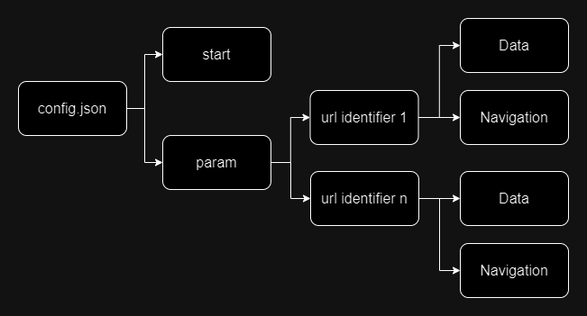
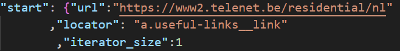
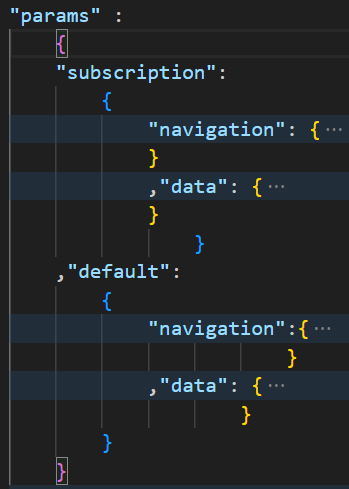
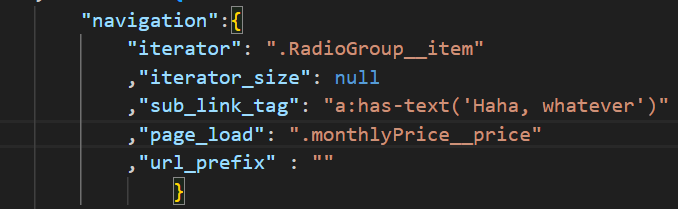
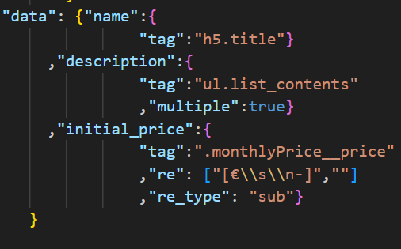

# Telenet Web Scraping Project

## Overview
This project involves using Selenium and Playwright to scrape data from telecom providers in general and Telenet.be more specifically. We successfully extracted information about products like internet, mobile and TV packages, promos, and over 570 gadgets available on the website. The Telenet website is dynamic and employs various anti-scraping measures, increasing the challenge of this project.

## Table of Contents
- [Requirements](#requirements)
- [Installation](#installation)
- [Usage](#usage)
- [Challenges](#challenges)
- [Scraping Strategy](#scraping-strategy)

## Requirements
- Python 3.10
- Chrome web browser
- Webdriver for Selenium and Playwright
- requirements.txt

## Installation
    

1. Clone the project repository to your local machine.
2. Create a virtual environment for the project and activate it:
   ```
   python -m venv venv
   source venv/bin/activate
   ```
3. Install the required Python packages using `pip`:
   ```
   pip install -r requirements.txt
   ```
4. Install playwright by following this official documentation: [install playwright](https://playwright.dev/python/docs/intro)

## Usage
The Scraper is split into 2 component parts:
- Dynamic, synchronous and configurable (for more details: [configuration](#configuration))
- Static and multi-threaded (focused on gadgets for telenet)

To run under the default configuration, just run `python main.py`. This will run both scrapers and save the data as csv file on the `data/` folder. This will, in order:

1. Navigate to the Telenet.be website and collect data as specified in the configuration file (defaults: products, packs and promotions). The scraped data will be saved to output csv files and store them in the data folder.

2. Navigate to the subsidized page (toestellen) and scrape all gadgets and their respective prices and attributes (memory, color etc)

Be mindful of the rate at which you make requests to the website to avoid overloading their servers and getting blocked. You may need to implement delays between requests.

## Challenges
The Telenet.be website presents several challenges for web scraping, including but not limited to:
- Dynamic content loaded via JavaScript.
- Frequent changes in the website's structure, which may require updating the scraping code.

## Scraping Strategy
Our scraping strategy involves using Selenium and Playwright to:
- Emulate user interactions to access product listings, promos, and gadgets.
- Extract data from dynamically loaded elements.
- Handle cookies buttons, if encountered.
- Store scraped data for analysis and further use.

## Disclaimer
Please note that web scraping may raise legal and ethical concerns. Ensure that your scraping activities comply with the website's terms of service and applicable laws and regulations. Use this code responsibly and respectfully.

## About us
Ying

Bo Cao, Data Engineer. <a href = 'https://www.linkedin.com/in/bo-cao-313ab244'> Linkedin </a>

<a href='https://github.com/henrique-rauen'>Henrique</a>, Data Scientist. <a href='https://www.linkedin.com/in/henrique-rauen/'> Linkedin </a>

Mykola

George

## Configuration

The `Scraper` reads a configuration file in json format in order to know how to navigate pages and which pages to scrape. The file has to be inside the `config` folder and it's name follows this pattern: `<provider>_config.json`, for example the current repository contains `telenet_promo_config.json`, `telenet_packs_config.json`, `mobile-vikings_config.json` among other. Each one of those files provides specific information on how to navigate those providers/subsections (as you can see telenet is split into 2 files for easier use). When instatiating the class Scraper, you need to provide a string telling which configuration file to use (you should ignore the suffix `_config.json`, for example `my_telenet_scraper = Scraper('telenet_promo')`).

THe config file itself follows this format:



The `start` key contains a dictionary with 3 elements:

- `url` (mandatory): Specifies the starting url for the scraper
- `locator` (mandatory): Specifies which part of the page to look for links
- `iterator_size` (optional): In case the above locator returns more objects than desired, this parameter can speficy a maximum number of values to be considered. It's best practice to use a more precise `locator`, but that's not always possible.



The `param` key is composed of a dict whose keys are spefic page identifiers. An indentifier is any part of an url to which this configuration should apply. One of the keys of this dictionary has to be `default` so that it's configuration can be used both as the starting building block for other configurations but also to be used completely when no specific configuration is avaliable.



In this case our `params` dict contains the `default` key (as it is mandatory) but also a `subscription` key. In this case any URL containing the word `subscription` will have the configuration defined applied to it. 

Each url identifier always contains 2 dictionaries: `navigation` and `data`. Let's look into `navigation` first:

- `iterator` (mandatory): Specifies which part of the page to iterate through looking for information.
- `iterator_size` (mandatory): In case the above locator returns more objects than desired, this parameter can speficy a maximum number of values to be considered. It's best practice to use a more precise `iterator`, but that's not always possible.
- `sub_link_tag` (mandatory): Specifies the links to look for inside the return of `iterator`. If no link is found, the scraper assumes that this is the page that should be scraped and stops navigating to start scraping.
- `page_load` (mandatory): Before doing anything on the page wait for the specified css element to show up.
- `url_prefix` (optional): In case the links require a prefix.



The `data` dictionary contains information on how to scrape the given page. It contains information about the fields to be scraped and how to find the element that contain them. The key name is the name of the field to be scraped (as it will show in the final csv file) and it's contents must involve:

- `tag` (mandatory): How to find that element.
- `multiple` (optional): In case the tag above returns more than one element and all of them must be concatenated as part of the result. Deafult is `false`
- `re` (optional): In case a regex pattern is to be applied to the field. The value includes the pattern and depending on the value of `re_type`, also what should substitute the match.
- `re_type` (optional): In case there's is a regex to be applied, what kind. Acceptable values are `sub` and `search`.



In this example we are scraping 3 different fields that we called:
- `name` Can be found using the specified tag.
- `description` The specified tag results multiple elements and we want all of them.
- `initial_price` The tag returns a value that is cleaned using a regex. Since the type is `sub`, the `re` key is a list whose second element is what should be used instead of what is matched. In this case €, spaces, line breaks and dashes will be substituted by empty space.

It's important to note that configurations for all pages will be built _on top_ of the default configuration, which means that the fields specified will be added/replace the fields present in the default. Thsi is done so that one does not need to rewrite the entire configuration for each page, you just need to replace what's special or add what is specific.

The examples shown above were taken from the file `sample_config.json` which can be found on the `config` folder. Other pre setup configuration are also present in that folder. 